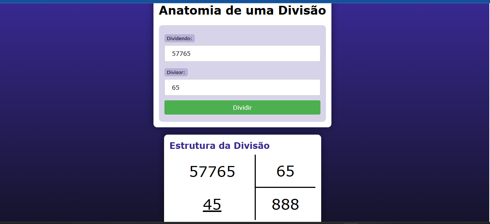

<h1 align="center"> App de Divisao </h1>

    Programa para realizar divisões .  

  <a href="#-tecnologias">Tecnologias</a>&nbsp;&nbsp;&nbsp;|&nbsp;&nbsp;&nbsp;
  <a href="#-projeto">Projeto</a>&nbsp;&nbsp;&nbsp;|&nbsp;&nbsp;&nbsp;

  

 

  

## 🚀 Tecnologias

Esse projeto foi desenvolvido com as seguintes tecnologias:

- HTML e CSS
- JavaScript
- Git e Github
- PHP

## 💻 Projeto

O App de Divisões serve para realizar divisões.

- [Acesse o projeto finalizado, online](https://github.com/goncl/appDivisao)
